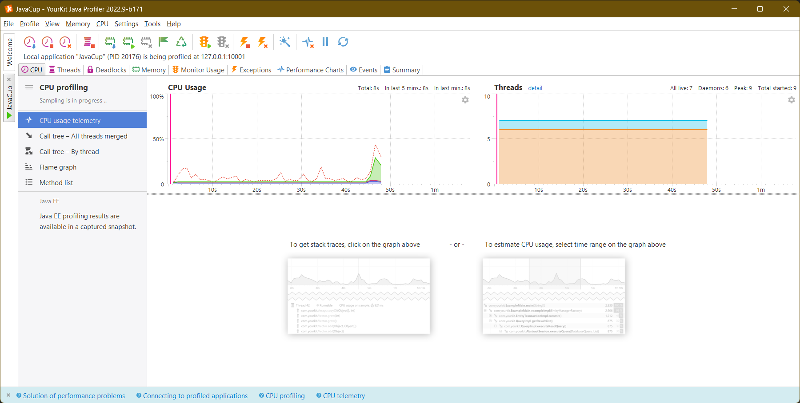

# SE-Lab-Exp4
### شماره دانشجویی
- Alireza Honarvar - 98102551
- Ali Najibi - 98106123

## موضوع
این پروژه درباره Java Profiling می‌باشد.

## گزارش
### 1.1. وصل کردن Yourkit به Intellij و مشاهده JavaCup در آن

تصویر زیر مربوط به زمان قبل از وارد کردن اعداد می‌باشد.

تصویر زیر پس از وارد کردن ۳ عدد می‌باشد. حال CPU Usage قابل مشاهده است.

در تصویر زیر، در نقطه اوج کلیک می‌کنیم و مشاهده می‌کنیم که تابع temp در حال مصرف منابع است.

این نکته را در Method list نیز مشاهده می‌کنیم.

در برنامه، به مشکل OutOfMemoryError می‌خوریم.

### 2.1. نوشتن قطعه‌ای کد و بهبود دادن آن
کد AlirezaClass را نوشته و اجرا می‌کنیم. می‌بینیم که بسیار کند است و بالای ۲ دقیقه منابع را اشغال می‌کند.

قطعه مشکل‌دار، تابع calculate:

حال کد را با dynamic programming می‌نویسیم و مشاهده می‌کنیم که بلافاصله اجرا و تمام می‌شود:

و کد تصحیح شده با استفاده از dp:

توضیحات:
میخواهیم کدی بنویسیم که در یک آرایه، زیردنباله با ماکسیمم مجموع اعداد را پیدا کند. به عنوان مثال در آرایه {-1, 3, 5, -10, 5} زیردنباله {3, 5} مجموع ماکسیمم را دارد.
در حالت اول، ۳ حلقه لوپ خواهیم داشت. اولی نشان‌دهنده مبدا، دومی مقصدا، و سومی اندیسی که از مبدا به مقصد حرکت می‌کند و مجموع را حساب می‌کند.
در این کد، با O(n^3) برنامه اجرا می‌شود و ماکسیمم مجموع در بین زیردنباله‌ها پیدا می‌شود.
سپس از برنامه‌نویسی پویا استفاده می‌کنیم. یک اندیس برای نشان دادن آخرین اندیس آرایه تنها انتخاب کرده، و از اولین اندیس شروع می‌کنیم و برای هر زیردنباله از اول تا آن اندیس، مجموع را محاسبه می‌کنیم. در این حالت تنها یک لوپ خواهیم داشت، که با دیدن هر اندیس جدید‌، میگوید ماکسیمم مورد نظر من یا صفر است، یا ماکسیمم قبلی بعلاوه عدد جدید. بدین صورت برای هر زیردنباله از صفر تا i (به ازای هر i) یک ماکسیمم مجموع در نظر گرفته می‌شود. حال یک بار دیگر لوپ می‌زنیم تا بین این اعداد ماکس را پیدا کنیم و خروجی دهیم. این الگوریتم با O(n) اجرا می‌شود و دیگر منابع بصورت طولانی مدت مصرف نمی‌گردند.